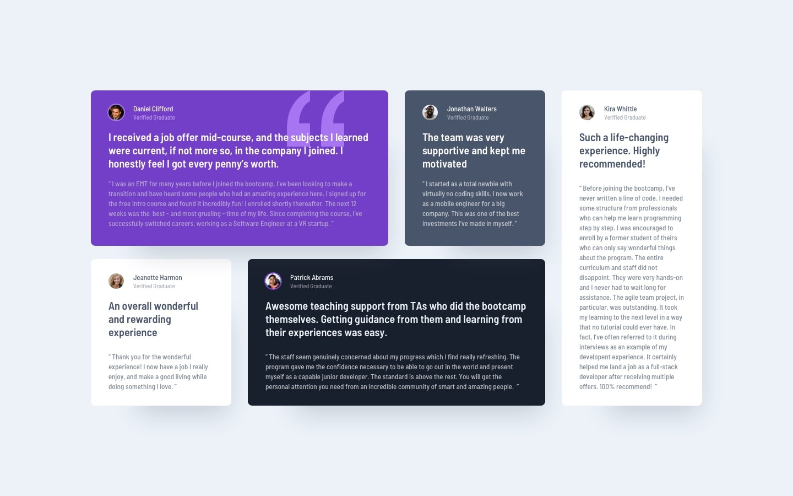

# Frontend Mentor - Testimonials grid section solution

Esta é uma solução para o [desafio Testimonials grid section no Frontend Mentor](https://www.frontendmentor.io/challenges/testimonials-grid-section-Nnw6J7Un7). Os desafios do Frontend Mentor ajudam você a melhorar suas habilidades de codificação criando projetos realistas.

## Índice:

- [Visão Geral](#visao-geral)
  - [O desafio](#o-desafio)
  - [Screenshot](#screenshot)
  - [Links](#links)
- [Meu processo](#meu-processo)
  - [Feito com](#feito-com)
  - [O que Aprendi](#o-que-aprendi)
  - [Desenvolvimento Contínuo](#continued-development)
  - [Useful resources](#useful-resources)
- [Autor](#autor)
- [Acknowledgments](#acknowledgments)

## Visão Geral

### O desafio

Os usuários devem ser capazes de:

- Visualizar o layout ideal para o site, dependendo do tamanho da tela do dispositivo

### Screenshot

Add a screenshot of your solution. The easiest way to do this is to use Firefox to view your project, right-click the page and select "Take a Screenshot". You can choose either a full-height screenshot or a cropped one based on how long the page is. If it's very long, it might be best to crop it.

Alternatively, you can use a tool like [FireShot](https://getfireshot.com/) to take the screenshot. FireShot has a free option, so you don't need to purchase it.

Then crop/optimize/edit your image however you like, add it to your project, and update the file path in the image above.

**Note: Delete this note and the paragraphs above when you add your screenshot. If you prefer not to add a screenshot, feel free to remove this entire section.**

### Links

## Meu processo

### Feito com

- HTML5
- Flexbox
- CSS Grid

### What I learned

### Desenvolvimento Continuo

### Useful resources

## Autor

- Website - [Luís Guilherme Theóphilo Malveira](https://github.com/LuisGuilhermeMalveira)
- Frontend Mentor - [@LuisGuilhermeMalveira](https://www.frontendmentor.io/profile/LuisGuilhermeMalveira)
- Instagram - [@luisgui21](https://www.instagram.com/luisgui21/)

## Agradecimentos
