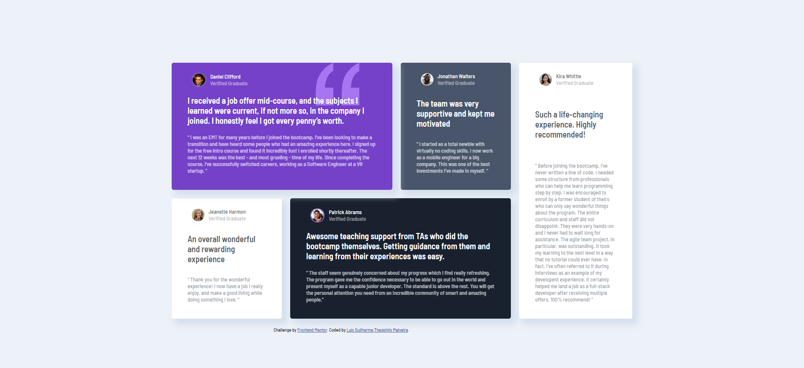

# Desafio: Testimonials grid section (Frontend Mentor)

## Bem-Vindo! 👋

Primeiro Projeto da mentoria do Pedro Marins. Nesse projeto vou treinar HTML/CSS me aprofundando um pouco mais em Grid.

Esta é uma solução para o [desafio Testimonials grid section no Frontend Mentor](https://www.frontendmentor.io/challenges/testimonials-grid-section-Nnw6J7Un7). Os desafios do Frontend Mentor ajudam você a melhorar suas habilidades de codificação criando projetos realistas.

## Índice:

- [Visão Geral](#visao-geral)
  - [O desafio](#o-desafio)  
  - [Link do Projeto](#link-do-projeto)
  - [Screenshots](#screenshots)
- [Meu processo](#meu-processo)
  - [Feito com](#feito-com)
  - [O que Aprendi](#o-que-aprendi)
  - [Recursos úteis](#recursos-úteis)
- [Autor](#autor)

## Visão Geral

### O Desafio

Os usuários devem ser capazes de:

- Visualizar o layout ideal para o site, dependendo do tamanho da tela do dispositivo

### Link do Projeto

- PROJETO - [Testimonials grid Section - Proposto pelo Front-end Mentor](https://luisguilhermemalveira.github.io/Projeto-Grid.io/)

### Screenshots
##### Site Desktop

##### Site Mobile  

## Meu processo

### Feito com

- HTML5
- Flexbox
- CSS Grid

### O que aprendi

- A mexer melhor com Grid e ter mais segurança a iniciar um projeto.
- A fazer uma boa aprensentação no GitHub.

### Recursos úteis

- Foi de extrema importancia rever alguns conceitos no curso: - [Origamid Grid](https://www.origamid.com/curso/css-grid-layout)
- Também utilizei o [Figma](https://www.figma.com/) para descobrir algumas distâncias e cores.

## Autor

- Website - [Luís Guilherme Theóphilo Malveira](https://github.com/LuisGuilhermeMalveira)
- Frontend Mentor - [@LuisGuilhermeMalveira](https://www.frontendmentor.io/profile/LuisGuilhermeMalveira)
- Instagram - [@luisgui21](https://www.instagram.com/luisgui21/)
